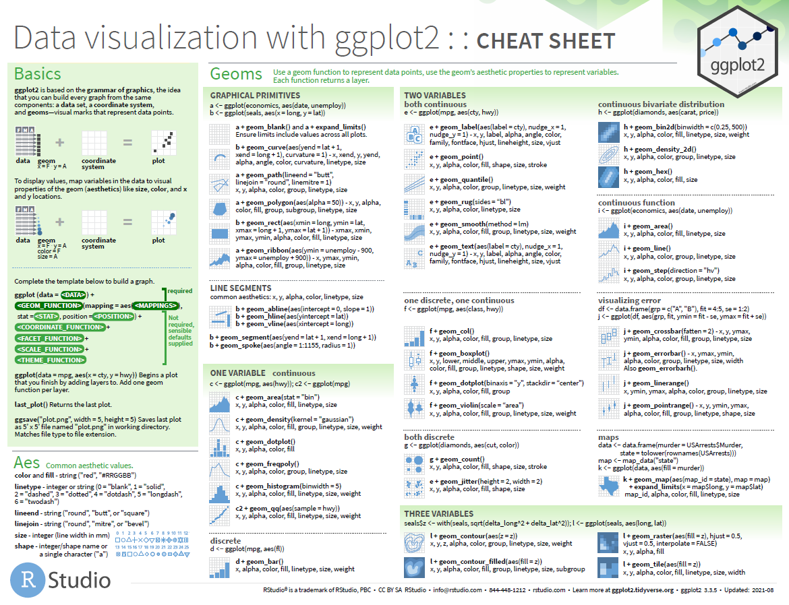
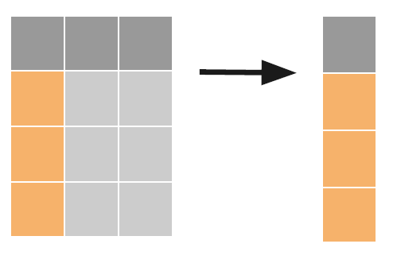
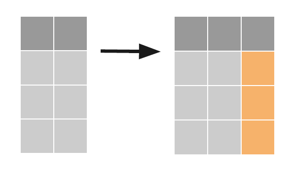
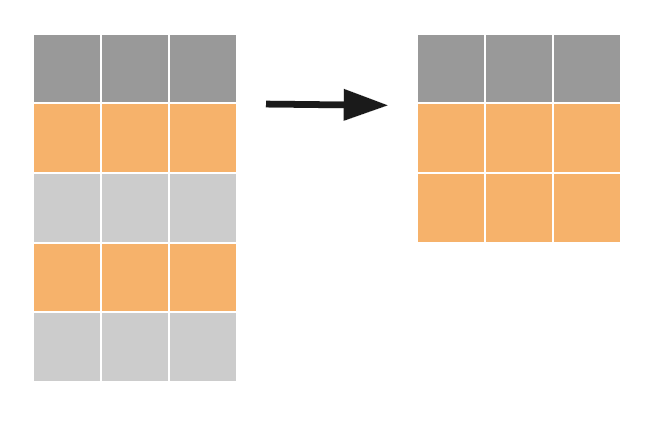
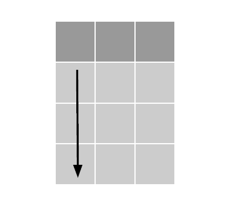
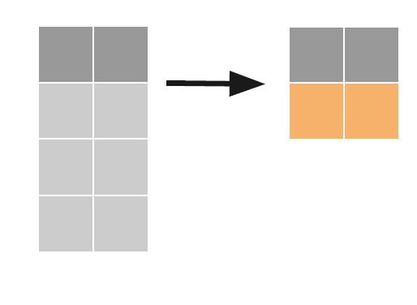
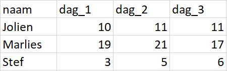
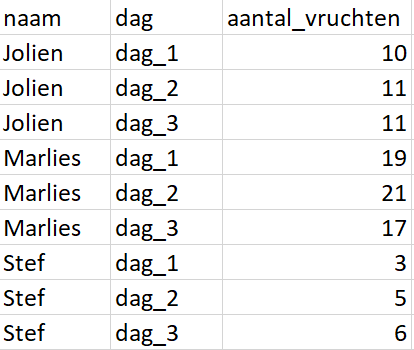

class: inverse

```{r message=FALSE, warning=FALSE, include=FALSE}
library(ggplot2)
library(imager)


```

# R WORKSHOP

_____________________

## Tidyverse and ggplot libraries

<br />
<br />
<br />
<br />
<br />
<br />
<br />


Dieter Baets <br />
Proefcentrum Hoogstraten <br />
February 23th, 2022 <br />
<br />
[Github](https://github.com/dbaets)


---

class: inverse

# Overview

1. Introduction to R and RStudio

2. Introduction to ggplot2

3. Introduction to table manipulation

4. Introduction to tidy data

5. Other packages to explore


---
class: inverse
________________________

# 1. Introduction to R and RStudio


---

class: inverse

# Why R?

* Open source programming language

* Mostly known as software environment for statistical computing

* Rising popularity in the data science community

* Capability is expandable by importing packages

* more than 11 000 packages available through CRAN, Bioconductor, Github, ...

* Most of the analysis are centered around data frames (= Excel spreadsheets or SQL tables)

---
class: inverse

# RStudio PBC

.pull-left[

* integrated development environment (IDE)

* Free and open source

* Cross platform (Windows, macOS and Linux)

* Also available for servers
]

.pull-right[

]

---
class: inverse

# RStudio cheat sheets

very good reference material if you can't remember the right syntax

* http://www.rstudio.com/resources/cheatsheets/

* using R studio help menu


---

class: inverse

_____________________

# 2. Introduction to GGPLOT 2

---

class: inverse

# grammar of graphics

" An abstraction which makes thinking, reasoning and communicating graphics easier"

* first described by Leland Wilkinson (Grammar of Graphics, 1999)

* Implemented in ggplot2 (Hadley Wickham)

* Divide your graphics in different layers based on grammar

**standard**, **customizable** building blocks to create your own visualization


---

class: inverse

# Excel vs ggplot 2 - click vs script

.pull-left[

]

.pull-right[

]


---

class: inverse

# Build your own ggplot graph

[ggplot2-book.org](https://ggplot2-book.org/) for more information.
<br />

A graph consists out of **three** main parts:
<br />
<br />

1. **DATA**

your dataset of interest
<br />
<br />

2. **AEStetic mapping**

an esthetic is a visual dimension of your graph that can be used to communicate information <br />
(e.g. x-axis, y-axis, color, shape...)
<br />
<br />

3. **GEOMs**

add a *layer* of geometric objects <br />
(e.g. points, lines, bars,...)


---

# Build your own ggplot graph

.pull-left[
```{r echo=TRUE, message=FALSE, warning=FALSE,eval=FALSE}
ggplot(data=iris,
       aes(x=Sepal.Length,
           y=Petal.Length)) + 
  geom_point()

```
]

.pull-right[

```{r message=FALSE, warning=FALSE, include=TRUE, echo=FALSE}
ggplot(data=iris,
       aes(x=Sepal.Length,
           y=Petal.Length)) + 
  geom_point()

```
]


---

# Build your own ggplot graph

.pull-left[
## Main layers

1. Data
2. Aesthetic mapping
3. Geom's

## Additional layers

4. Stats
5. Position adjustments       
6. Scales
7. Facets
8. Coord
9. Themes
]

.pull-right[
<br />
<br />
<br />
<br />
<br />
<br />
<br />
<br />
<br />
<br />
<br />
<br />

statistical transformations <br />
resolves overlapping geoms <br />
tweak details like the axis labels or legend keys <br />
display different subsets of the data <br />
change how the x and y aesthetic combine <br />
control the display of all non-data elements of the plot <br />

]


---

# Aesthetic mapping

.pull-left[
```{r echo=TRUE, message=FALSE, warning=FALSE,eval=FALSE}
ggplot(data=iris,
       aes(x=Sepal.Length,
           y=Petal.Length)) + 
  geom_point()

```
]

.pull-right[

```{r message=FALSE, warning=FALSE, include=TRUE, echo=FALSE}
ggplot(data=iris,
       aes(x=Sepal.Length,
           y=Petal.Length)) + 
  geom_point()

```
]


---

# Aesthetic mapping

.pull-left[
- color

```{r echo=TRUE, message=FALSE, warning=FALSE,eval=FALSE}
ggplot(data=iris,
       aes(x=Sepal.Length,
           y=Petal.Length,
           color = Species)) + #<<
  geom_point()

```
]

.pull-right[

```{r message=FALSE, warning=FALSE, include=TRUE, echo=FALSE}
ggplot(data=iris,
       aes(x=Sepal.Length,
           y=Petal.Length, 
           color = Species)) +
  geom_point()

```
]

---

# Aesthetic mapping

.pull-left[
- color
- shape

```{r echo=TRUE, message=FALSE, warning=FALSE,eval=FALSE}
ggplot(data=iris,
       aes(x=Sepal.Length,
           y=Petal.Length,
           shape = Species)) + #<<
  geom_point()

```
]

.pull-right[

```{r message=FALSE, warning=FALSE, include=TRUE, echo=FALSE}
ggplot(data=iris,
       aes(x=Sepal.Length,
           y=Petal.Length, 
           shape = Species)) +
  geom_point()

```
]

---

# Aesthetic mapping

.pull-left[
- color
- shape
- alpha

```{r echo=TRUE, message=FALSE, warning=FALSE,eval=FALSE}
ggplot(data=iris,
       aes(x=Sepal.Length,
           y=Petal.Length,
           alpha = Species)) + #<<
  geom_point()

```
]

.pull-right[

```{r message=FALSE, warning=FALSE, include=TRUE, echo=FALSE}
ggplot(data=iris,
       aes(x=Sepal.Length,
           y=Petal.Length, 
           alpha = Species)) +
  geom_point()

```
]

---

# Aesthetic mapping

.pull-left[
- color
- shape
- alpha
- size

```{r echo=TRUE, message=FALSE, warning=FALSE,eval=FALSE}
ggplot(data=iris,
       aes(x=Sepal.Length,
           y=Petal.Length,
           size = Species)) + #<<
  geom_point()

```
]

.pull-right[

```{r message=FALSE, warning=FALSE, include=TRUE, echo=FALSE}
ggplot(data=iris,
       aes(x=Sepal.Length,
           y=Petal.Length, 
           size = Species)) +
  geom_point()

```
]

---

# Aesthetic mapping

.pull-left[
**Combination**

```{r echo=TRUE, message=FALSE, warning=FALSE,eval=FALSE}
ggplot(data=iris,
       aes(x=Sepal.Length,
           y=Petal.Length,
           color = Species, #<<
           size = Sepal.Width, #<<
           alpha = Petal.Width)) + #<<
  geom_point()

```
]

.pull-right[

```{r message=FALSE, warning=FALSE, include=TRUE, echo=FALSE}
ggplot(data=iris,
       aes(x=Sepal.Length,
           y=Petal.Length,
           color = Species, 
           size = Sepal.Width, 
           alpha = Petal.Width)) +
  geom_point()

```
]


---

# Geoms

.pull-left[
- geom_line()
- geom_point()
- geom_bar()
- geom_boxplot()
- geom_violin()
- geom_ridgeline()
- ...
]

.pull-right[


]

---
# Building different layers
.pull-left[
```{r echo=TRUE, message=FALSE, warning=FALSE,eval=FALSE}
ggplot(data=iris) +
  geom_boxplot(aes(x = Species,
                   y = Sepal.Length,
                   fill = Species))

```
]
.pull-right[
```{r message=FALSE, warning=FALSE, include=TRUE, echo=FALSE}
ggplot(data=iris) +
  geom_boxplot(aes(x = Species,
                   y = Sepal.Length,
                   fill = Species))

```
]

---
# Building different layers
.pull-left[
```{r echo=TRUE, message=FALSE, warning=FALSE,eval=FALSE}
ggplot(data=iris) +
  geom_boxplot(aes(x = Species,
                   y = Sepal.Length,
                   fill = Species)) + 
  geom_point(aes(x = Species,
                 y = Sepal.Length),
             alpha = 0.3)

```
]
.pull-right[
```{r message=FALSE, warning=FALSE, include=TRUE, echo=FALSE}
ggplot(data=iris) +
  geom_boxplot(aes(x = Species,
                   y = Sepal.Length,
                   fill = Species)) + 
  geom_point(aes(x = Species,
                 y = Sepal.Length),
             alpha = 0.3)

```
]

---

# Data import

Data formatting and data handeling will be discussed later on, for now just read in data using :
- read_csv()
- read_xlsx() from the readxl package (don't forget to add sheet name as parameter)
- read_tsv()
- read_table()

---
class: inverse

_________________

# Demonstration

---
class: inverse

# Excersise

1. Laad '*sampledata.tsv*' in <br />
2. Bekijk de dataset en zijn variabelen <br />
3. Visualiseer het aantal mannelijke en vrouwelijke deelnemers gebruik makend van een staafdiagram <br />
4. Doe het zelfde voor de nationaliteit van de deelnemers <br />
5. Maak een boxplot om de leeftijdsdistributie te visualiseren. Kan je met de 'fill' command een andere kleur aan de grafieken geven? <br />
6. voeg aan de boxplot in punt 5 een extra laag toe met punten (geom_point()). Wat gebeurd er als je geom_jitter() gebruikt in plaats van geom_point? <br />
7. **Extra:** Maak een density plot gebruik makend van de leeftijdsvariabele (age) van alle deelnemers. Kleur in volgens gender en maak een facet per nationaliteit.

---
class: inverse

# Additional ggplot tweeking
- rename titles
- facet graphing
- scale [colour brewer](https://www.r-graph-gallery.com/38-rcolorbrewers-palettes.html) - nicer colours 


---
class: inverse

# theme's

Standard theme's are loaded when the *ggplot2* library is loaded.
adding a layer using theme_XXXX() argument

<br />
<br />
<br />

or by creating own theme = pch theme

```{r}
theme_PCH_nolines <- function (base_size = 11,
                               base_family = "",
                               base_line_size = base_size/22, 
                               base_rect_size = base_size/22) 
{
  theme_bw(base_size = base_size,
           base_family = base_family,
           base_line_size = base_line_size,
           base_rect_size = base_rect_size) %+replace%
    
    theme(panel.border = element_blank(),
          panel.grid.major = element_blank(), 
          panel.grid.minor = element_blank(),
          axis.line = element_line(colour = "grey70",
                                   size = rel(1)),
          axis.ticks = element_line(colour = "grey70", 
                                    size = rel(0.5)),
          legend.key = element_blank(),
          strip.background = element_rect(fill = "white",
                                          colour = "grey70",
                                          size = rel(2)),
          complete = TRUE)
}
```

---
# adding theme to graph

.pull-left[
```{r echo=TRUE, message=FALSE, warning=FALSE,eval=FALSE}
ggplot(data=iris) +
  geom_boxplot(aes(x = Species,
                   y = Sepal.Length,
                   fill = Species)) + 
  geom_point(aes(x = Species,
                 y = Sepal.Length),
             position =  position_jitter())

```
]
.pull-right[
```{r echo=TRUE, message=FALSE, warning=FALSE,eval=FALSE}
ggplot(data=iris) +
  geom_boxplot(aes(x = Species,
                   y = Sepal.Length,
                   fill = Species)) + 
  geom_point(aes(x = Species,
                 y = Sepal.Length),
             position =  position_jitter()) +
  theme_PCH_nolines()

```
]

---
# adding theme to graph

.pull-left[
```{r message=FALSE, warning=FALSE, include=TRUE, echo=FALSE}
ggplot(data=iris) +
  geom_boxplot(aes(x = Species,
                   y = Sepal.Length,
                   fill = Species)) + 
  geom_point(aes(x = Species,
                 y = Sepal.Length),
             position =  position_jitter())

```
]
.pull-right[
```{r message=FALSE, warning=FALSE, include=TRUE, echo=FALSE}
ggplot(data=iris) +
  geom_boxplot(aes(x = Species,
                   y = Sepal.Length,
                   fill = Species)) + 
  geom_point(aes(x = Species,
                 y = Sepal.Length),
             position =  position_jitter()) +
  theme_PCH_nolines()

```
]

---
# Changing colours

.pull-left[
```{r}
primary_colours <- c("#28572A","#6BA13C","#19AFE6")
```


```{r echo=TRUE, message=FALSE, warning=FALSE,eval=FALSE}
ggplot(data=iris) +
  geom_boxplot(aes(x = Species,
                   y = Sepal.Length,
                   fill = Species)) + 
  scale_fill_manual(primary_colours) +
  geom_point(aes(x = Species,
                 y = Sepal.Length),
             position =  position_jitter())

```
]
.pull-right[
```{r message=FALSE, warning=FALSE, include=TRUE, echo=FALSE}
ggplot(data=iris) +
  geom_boxplot(aes(x = Species,
                   y = Sepal.Length,
                   fill = Species)) + 
  scale_fill_manual(values = primary_colours) +
  geom_point(aes(x = Species,
                 y = Sepal.Length),
             position =  position_jitter()) +
  theme_PCH_nolines()

```
]


---

class: inverse

_____________________

# 3. Table manipulation


---
class: inverse

# The Tidyverse

Multitude of R packages for data science

* set of tools to transform and visualise data

* all packages share the same underlying philosophy so you can use the easy

* most of the are created by Hadley Wickham

* examples:

  * ggplot2

  * dplyr

  * tidyr

  * readr

  * ...

---
class: inverse

# Grammar of data manipulation

ggplot: grammar of graphics -> similar *grammar of data manipulation*
<br />

**tibble**

* tibble as input (first argument)
* function that perform one task
* tibble as output

complex tasks can be expressed as sequence of simple verbs


---
class: inverse

# Grammar of data manipulation

package **dplyr**
<br />

5 essential verbs:
* *`select()`*: select columns
* *`mutate()`*: make new columns
* *`filter()`*: select rows
* *`arrange()`*: order rows
* *`summarize()`*: summarize rows

---
class: inverse

# Select columns: `select()`

.pull-left[
`tibble <- select(tibble, var_1, var_2, ...)`

you can use helper verbs for variable selection:
* `contains()`
* `starts_with()`
* `ends_with()`
* `-`
]
.pull-right[

]

---
class: inverse

# Make columns: `mutate()`

.pull-left[
`tibble <- mutate(tibble,` <br />
`new_var_1 = expression_1,` <br />
`new_var_2 = expression_2, ...)`

Use '=', not `<-` <br />

the expression should result in a vector or in one value
]

.pull-right[

]


---
class: inverse

# Make columns: `filter()`

.pull-left[
`tibble <- filter(tibble, logical_variable)`

logical variable:
* type directly: c(T, F, T, T, F, F, F, ...)
* create from variables:
  * ==, !=, >, <, >=, <=, %in%
  * ´is.na()´

]

.pull-right[

]

---
class: inverse

# Make columns: `arrange()`

.pull-left[
`tibble <- arrange(tibble, var_1, - var_2)`

use '-' to sort in inverse order

]

.pull-right[

]

---
class: inverse

# Make columns: `summarize()`

.pull-left[
`tibble <- summarize(tibble,` <br />
 `aggregated_var = espression)`

expression should result in one value:
* `mean()`
* `median()`
* `sd()`
* `sum()`

]

.pull-right[

]


---
class: inverse

# Group-wise analysis

you can add a grouping structure to a tibble:
* computations within other verbs (e.g. `mutate()`, `summarize()`) will happen per group
* verbs:
  * `group_by()`: add grouping
  * `ungroup()`: remove grouping
* you can group by multiple variables simultaneously. The different groups will be combinations of the variable values


---
class: inverse

# The pipe operator (`%>%`)

read as: pass output of previous chunk as first argument of following chunk <br />
<br />
<br />
f(x, y) can be written as x `%>%` f(y) <br />

<br />
advantages:
* less typing
* less redundancy (+ easier to change object names)
* more readable code

---
class: inverse

_______
# Exercise

1. **Import** de data uit file "sampledata.tsv" als een tibble
2. **Filter** uit alle rijen waar de variable "nationality" of "bmi_group" een NA waarde bevatten. Deze rijen zijn missing en hebben we dus niet nodig. Laat alle andere variabele vallen buiten 'nationality' en 'bmi_group'. Sla het resultaat op in een nieuwe tibble: "sample_data_filtered".
3. Start van vorige tibble en maak een summary ("sample_data_summary") waarin de hoeveelheid deelnemers wordt bepaald, gegroepeerd per nationaliteit en bmi groep.
4. Maak van voorgaande summary een bar plot om te bekijken welke nationaliteiten een hoger aantal obese deelnemers had.

---
class: inverse

_______________
# 4. Introduction to tidy data


---
# Untidy data

.pull-left[
How would you make the following figure using ggplot2:
* day on the x-axis
* count on the y-axis (number of fruits)
]

.pull-right[

]


---
# Untidy data

.pull-left[
**Plotting is impossible!!**
<br />
<br />

Why? <br />

* Number of fruits should be the variable name but is spread over multiple columns
* Day should be a variable, but this is information shown in the column headers
]

.pull-right[

]

---
# Tidy data

.pull-left[
What changed?
<br />
<br />

1. the variable aantal_vruchten is now one column
2. the variable dag is now a separate column
3. values in all other columns are duplicated

<br />

* each row corresponds to one observation
* each column corresponds to one variable

]

.pull-right[

]


---
class: inverse
# Tidying verbs

.pull-left[
Package 'tidyr':
* `gather()`: make table tidy (wide to long)
* `spread()`: make table untidy (long to wide)
]

.pull-right[
`tibble <- gather(tibble, value = "variable_values",
key = "variable_headers", var_1, var_2,...)`

Input:
1. the variables you want to gather into one variable
2. the name of that new variable (value)
3. the name of the new variable with the info from the headers (key)
]

---
class: inverse
# Why tidy data?

easier to create ggplot visualisations
<br />
easier to manipulate
<br />
more scalable format (adidng more values is easy)


---
class: inverse

__________

# 5. Other tidyverse packages
* *lubridate* = work with different time formats
* *rvest* = scrabe the web for data
* *purr* = functional programming
* *stringr* = work with strings


---

class: center, middle, inverse

# Thanks!

## Dieter Baets - dieterbaets@gmail.com

Slides created via the R package [**xaringan**](https://github.com/yihui/xaringan). <br /> <br />
The workshop contents is based on the 2018 University of Antwerp Tidyverse Workshop <br /> by Sander Wuyts and Stijn Wittouck.

