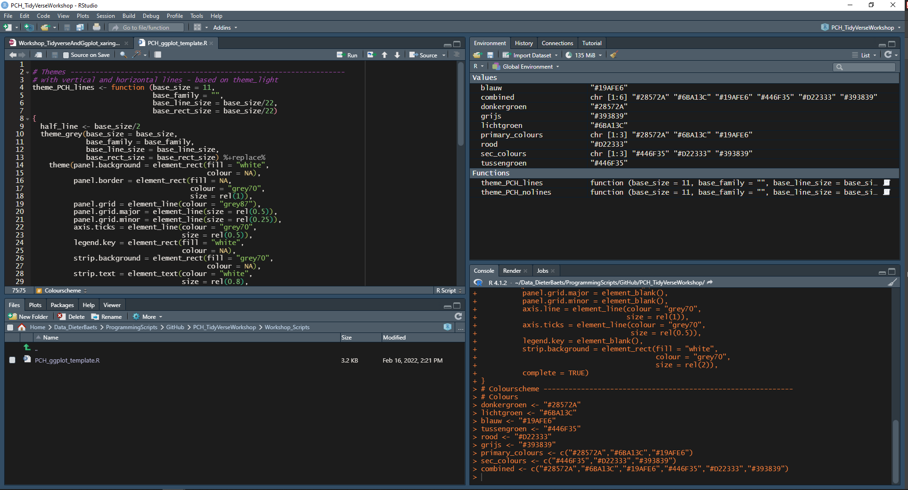
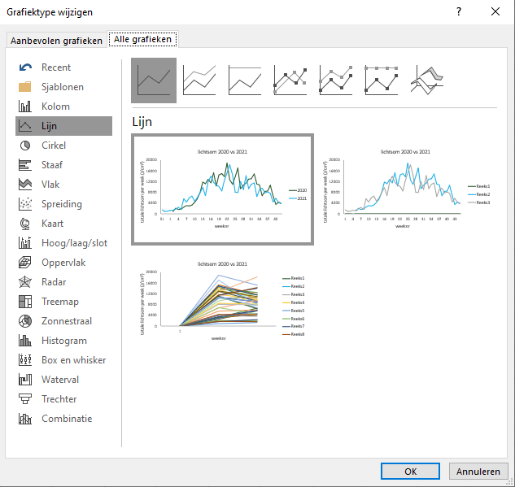
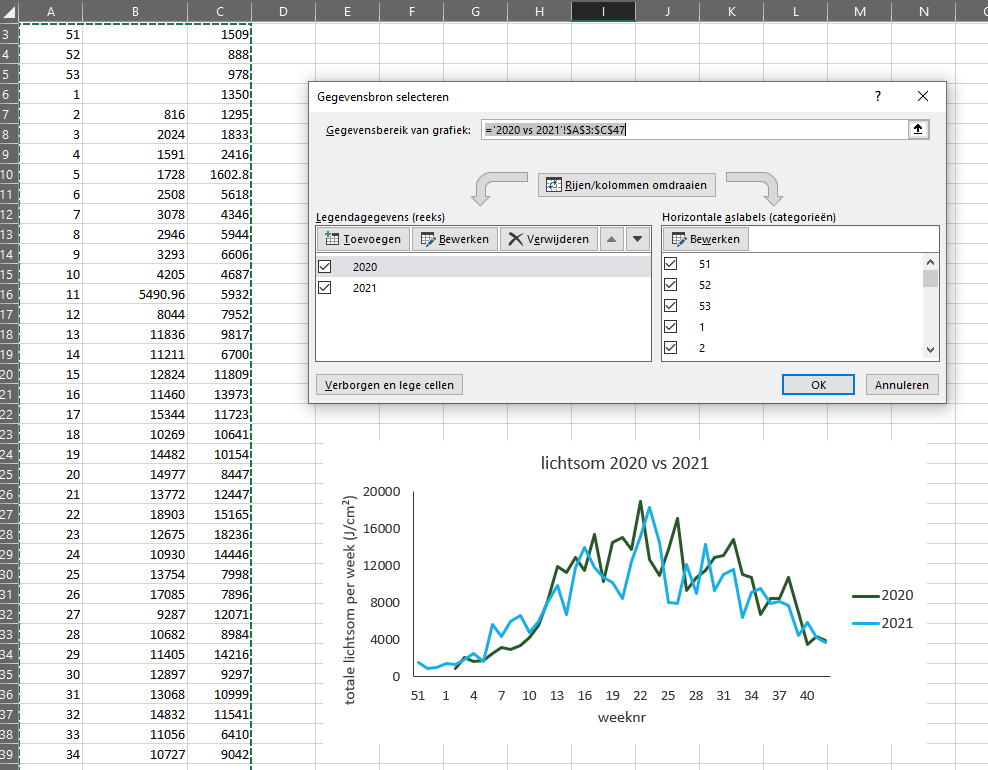

class: inverse

```{r message=FALSE, warning=FALSE, include=FALSE}
library(ggplot2)
library(imager)


```

# R WORKSHOP

## Tidyverse and ggplot libraries

<br />
<br />
<br />
<br />
<br />
<br />
<br />


Dieter Baets <br />
Proefcentrum Hoogstraten <br />
February 23th 2022


---

class: inverse

# Overview

1. Introduction to R and RStudio

2. Introduction to ggplot2

3. Introduction to table manipulation

4. Introduction to tidy data

5. (Additional ggplot2 tweaking)

6. (Additional table processing functions)

7. Other packages to explore


---
class: inverse
________________________

# 1. Introduction to R and RStudio


---

class: inverse

# Why R?

* Open source programming language

* Mostly known as software environment for statistical computing

* Rising popularity in the data science community

* Capability is expandable by importing packages

  * more than 11 000 packages available through CRAN, Bioconductor, Github, ...
  
* Most of the analysis are centered around data frames (= Excel spreadsheets or SQL tables)

---
class: inverse

# RStudio PBC

.pull-left[

* integrated development environment (IDE)

* Free and open source

* Cross platform (Windows, macOS and Linux)

* Also available for servers
]

.pull-right[

]

---
class: inverse

# RStudio cheat sheets

very good reference material if you can't remember the right syntax

* http://www.rstudio.com/resources/cheatsheets/

* using R studio help menu


---

class: inverse

_____________________

# 2. Introduction to GGPLOT 2

---

class: inverse

# grammar of graphics

" An abstraction which makes thinking, reasoning and communicating graphics easier"

* first described by Leland Wilkinson (Grammar of Graphics, 1999)

* Implemented in ggplot2 (Hadley Wickham)

* Divide your graphics in different layers based on grammar

**standard**, **customizable** building blocks to create your own visualization


---

class: inverse

# Excel vs ggplot 2 - click vs script

.pull-left[

]

.pull-right[

]


---

class: inverse

# Build your own ggplot graph

a graph consists out of three main parts:
<br />
<br />

1. **DATA**

  your dataset of interest
  <br />
  <br />
  
2. **AEStetic mapping**

  an esthetic is a visual dimension of your graph that can be used to communicate information <br />
  (e.g. x-axis, y-axis, color, shape...)
  <br />
  <br />
  
3. **GEOMs**

  add a *layer* of geometric objects <br />
  (e.g. points, lines, bars,...)
  
  
---

# Build your own ggplot graph

.pull-left[
```{r echo=TRUE, message=FALSE, warning=FALSE,eval=FALSE}
ggplot(data=iris,
       aes(x=Sepal.Length,
           y=Petal.Length)) + 
  geom_point()

```
]

.pull-right[

```{r message=FALSE, warning=FALSE, include=TRUE, echo=FALSE}
ggplot(data=iris,
       aes(x=Sepal.Length,
           y=Petal.Length)) + 
  geom_point()

```
]


---

# Build your own ggplot graph

.pull-left[
```{r echo=TRUE, message=FALSE, warning=FALSE,eval=FALSE}
ggplot(data=iris,
       aes(x=Sepal.Length,
           y=Petal.Length,
           color = Species)) + #<<
  geom_point()

```
]

.pull-right[

```{r message=FALSE, warning=FALSE, include=TRUE, echo=FALSE}
ggplot(data=iris,
       aes(x=Sepal.Length,
           y=Petal.Length, 
           color = Species)) +
  geom_point()

```
]


---

# Build your own ggplot graph

.pull-left[
## Main layers

1. Data
2. Aesthetic mapping
3. Geom's

## Additional layers

4. Stats
5. Position adjustments       
6. Scales
7. Facets
8. Coord
9. Themes
]

.pull-right[
<br />
<br />
<br />
<br />
<br />
<br />
<br />
<br />
<br />
<br />
<br />
<br />

statistical transformations <br />
resolves overlapping geoms <br />
tweak details like the axis labels or legend keys <br />
display different subsets of the data <br />
change how the x and y aesthetic combine <br />
control the display of all non-data elements of the plot <br />

]


---

# Data

Data formatting and data handeling will be discussed later on, for now just read in data using :
- read_csv()
- read_xlsx() from the readxl package

---

# Aesthetic mapping

cars


---
class: inverse

# The Tidyverse

Multitude of R packages for data science

* set of tools to transform and visualise data

* all packages share the same underlying philosophy so you can use the easy

* most of the are created by Hadley Wickham

* examples:

  * ggplot2
  
  * dplyr
  
  * tidyr
  
  * readr
  
  * ...


---
class: inverse

# Datasets

* Oogst en sorteringsdataset paprika

* demonstration dataset from NCBI's Eukaryte genome data

add tidyverse logo


---

class: center

# Hand seals (印)

Press `h` or `?` to see the possible ninjutsu you can use in remark.js.


---

class: center, middle

# Thanks!

Slides created via the R package [**xaringan**](https://github.com/yihui/xaringan).

The chakra comes from [remark.js](https://remarkjs.com), [**knitr**](https://yihui.org/knitr/), and [R Markdown](https://rmarkdown.rstudio.com).
